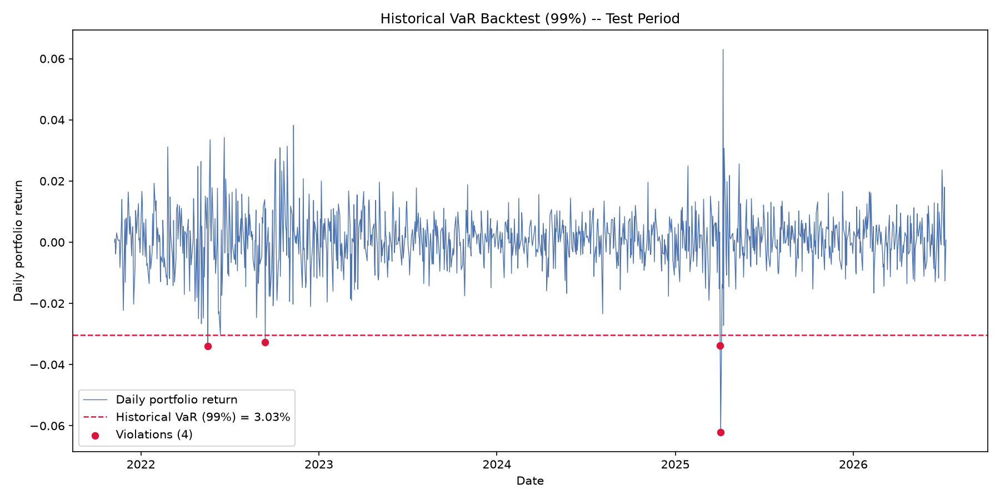
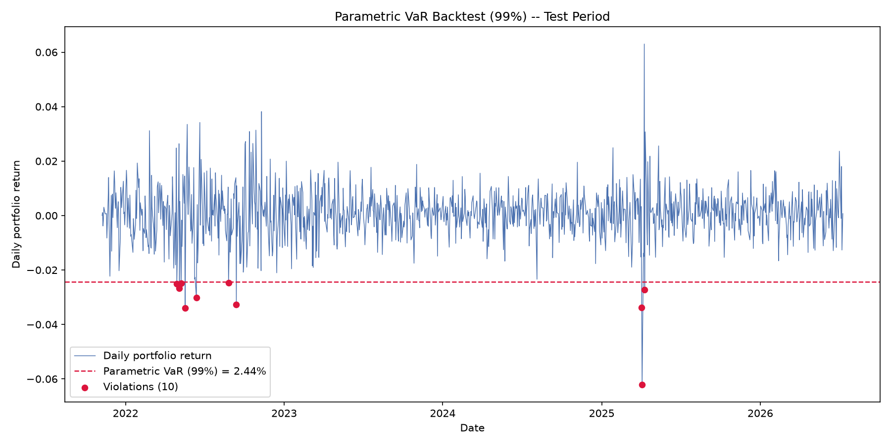

# Risk-Model Evaluation

Statistical backtesting of Value-at-Risk (VaR) models on a real equity
portfolio: does the risk a model *promises* actually hold up on data it
never saw?

Three VaR methods — Historical, Parametric (Gaussian), and Monte Carlo —
are implemented behind one common interface, extended to Expected
Shortfall, and checked out-of-sample with Kupiec's proportion-of-failures
test and Christoffersen's independence test. The full research note is in
[`notebooks/analysis.ipynb`](notebooks/analysis.ipynb).

## The question

A VaR model makes a specific, checkable promise: *"on 99 out of 100 days,
you won't lose more than X%."* The going-in hypothesis was the textbook
one — that Gaussian VaR underestimates tail risk and fails its backtest
while Historical VaR, unconstrained by any distributional assumption,
holds up better. That is not what the backtest found.

## The finding

Portfolio: 5 sector-diverse US large-caps (AAPL, JPM, XOM, JNJ, PG),
equal-weighted, daily 2011–2026. Split 70/30 in time order — train on
2011–2021, test on 2021–2026, never shuffled.

| Method | Confidence | VaR | Violations (observed / expected) | Kupiec | Christoffersen |
|---|---|---|---|---|---|
| Historical | 99% | 3.03% | 4 / 11.7 | FAIL (p=0.009) | FAIL (p=0.008) |
| Parametric | 99% | 2.44% | 10 / 11.7 | PASS (p=0.606) | PASS (p=0.071) |
| Monte Carlo | 99% | 2.46% | 10 / 11.7 | PASS (p=0.606) | PASS (p=0.071) |
| Historical | 95% | 1.57% | 38 / 58.6 | FAIL (p=0.003) | FAIL (p=0.038) |
| Parametric | 95% | 1.71% | 33 / 58.6 | FAIL (p<0.001) | FAIL (p=0.013) |
| Monte Carlo | 95% | 1.72% | 32 / 58.6 | FAIL (p<0.001) | FAIL (p=0.010) |

Every model failed at 95%, and Historical specifically failed at 99% while
Parametric and Monte Carlo passed — and every failure is a model being
**too conservative**, not too aggressive. Most likely mechanism: the
training window (2011–2021) contains the March 2020 COVID crash, one of
the most extreme volatility events on record. Historical VaR bakes that
crash directly into its empirical quantile, producing a *wider* threshold
than Parametric's — the opposite of the usual "Gaussian is too narrow"
story — which then goes mostly unbreached against a calmer 2021–2026.

<p align="center">
  
  
</p>

The violations aren't scattered randomly either — they cluster into two
episodes (the 2022 rate-hike selloff, and one ~-6.3% day in mid-2025),
which is exactly what Christoffersen's test is built to catch, and why
Parametric/Monte Carlo's borderline pass (p=0.071) is less reassuring than
it looks in isolation.

This is treated as a finding worth reporting, not a disappointing result
to explain away — the goal of this project was never to confirm a
specific textbook story, it was to build a pipeline rigorous enough to
find out either way. Full discussion, including the split-sensitivity
limitation, is in the notebook.

## Repository structure

```
├── src/
│   ├── data.py                # fetch prices, compute returns, temporal train/test split
│   ├── var_models.py          # 3 VaR methods behind one fit()/calculate() interface
│   ├── expected_shortfall.py  # ES for all 3 methods (plain functions)
│   ├── backtests.py           # Kupiec POF + Christoffersen independence tests
│   └── plots.py                # visualization, isolated from analysis logic
├── tests/                      # correctness tests: known analytical answers,
│                                # hand-computed quantiles, hand-countable edge cases
├── notebooks/
│   └── analysis.ipynb          # the research note — question, method, results, verdict
├── results/figures/             # committed output plots
└── data/                        # gitignored — never commit market data
```

## Methods implemented

- **Historical VaR/ES** — empirical quantile / tail average of real returns. No
  distributional assumption; only as good as the historical window observed.
- **Parametric (Gaussian) VaR/ES** — closed-form under Normal(μ, σ). Fast, but
  only as correct as the Normal assumption — the assumption this whole
  project tests.
- **Monte Carlo VaR/ES** — 100,000 simulated draws from the same Normal(μ, σ),
  read the same way Historical reads real data. Converges to the Parametric
  answer by construction; demonstrates the technique rather than adding
  independent information for a single aggregated return series.
- **Kupiec's POF test** — does the violation *count* match the promised rate.
- **Christoffersen's independence test** — do violations *cluster* in time,
  which a pure count can't detect.

Expected Shortfall is implemented and its coherence (vs. VaR's) is
discussed, but is not itself statistically backtested — that would need
machinery (e.g. the Acerbi–Szekely test) outside this project's scope.

## Running it

```bash
python -m venv .venv
.venv/Scripts/activate        # .venv/bin/activate on macOS/Linux
pip install -r requirements.txt

pytest                         # run the correctness tests
jupyter notebook notebooks/analysis.ipynb   # open the research note
```

Data is fetched live from Yahoo Finance (`yfinance`) on a fixed historical
date range, so results are reproducible without needing any committed
data files.

## Limitations

- The headline result is partly an artifact of *where* the 70/30 split
  falls relative to the COVID crash — not a universal law about Historical
  vs. Parametric VaR.
- VaR is static per test window (fit once on train, held fixed), not
  rolling — a deliberate scope boundary, since rolling re-estimation edges
  toward time-varying volatility methods (EWMA/GARCH) outside this
  project's toolkit.
- One portfolio, one historical window. The finding is about this backtest,
  not a general verdict on any method.

## License

MIT — see [LICENSE](LICENSE).
